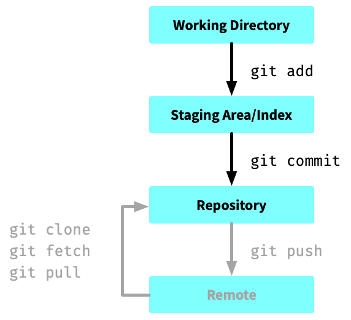
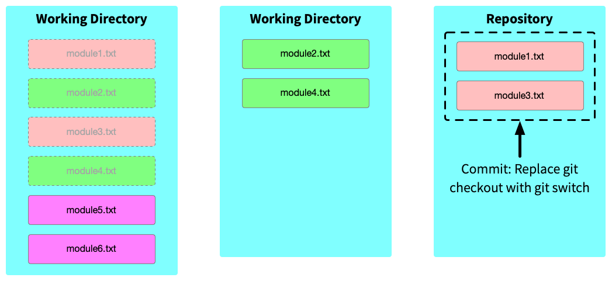

# Introduction to Git

## Course Overview

This course is designed to equip programmers, data scientists, technical authors, etc. with essential Git skills for effective version control in projects.

### Sections

1. Introduction to Version Control
2. Installation of Git
3. Basic Git Commands
4. Branching and Stashing
5. Merging and Resolving Conflicts
6. Using a Git GUI
7. Rebasing for a Clean Project History
8. Collaboration and Remote Repositories with GitHub
9. Git Workflows
10. Undoing Changes, Exploring History, and Managing Versions
11. Using Git Reflogs to Retrieve Lost Work
12. Best Practices in Using Git

## Section 1: Introduction to Version Control

### Key Concepts of Version Control

- **Version Control**: A system that records changes to a file or set of files over time, allowing you to revert to specific versions later.
- **Version Control System (VCS)**: Tracks the history of changes as files evolve. Enables collaborative work on projects and safekeeping of historical versions.

### Why Version Control?

- **Change Tracking**: Keeps a record of who made which changes and why, crucial for collaborative projects.
- **Collaboration**: Facilitates multiple people working on the same project, even on the same files, without losing work.
- **Backup and Recovery**: Offers a backup of work and an easy way to revert to previous states in case of errors or unwanted changes.
- **Data Management**: Allows tracking of experiments, including changes in data, code, and models.

### Version Control beyond Software Development

- **Data vs. Code**: Data-driven projects (and game development) often involve large datasets alongside code, requiring effective handling of both.
- **Reproducibility**: Ensuring that data analysis is reproducible requires careful tracking of data, code, and computational environments.
- **Collaboration Challenges**: Large project teams may include diverse roles such as data engineers, analysts, scientists and technical writers each with different needs and workflows.
- **Documentation**: May include less technical team members.

### Overview of Git

- **Git**: A distributed version control system, [widely used](https://stackoverflow.blog/2023/01/09/beyond-git-the-other-version-control-systems-developers-use/) in software development, known for its efficiency and flexibility.
- **Centralised vs. Distributed VCS**: Centralised systems store all versions in a single central repository, while distributed systems like Git allow each user to have a complete copy of the repository.
- **Popular**: Git is popular due to its robustness, support for non-linear development (branching), and widespread community adoption.

### Best Practices when Using Git

- Regularly commit changes with meaningful commit messages.
- Sync with remote repositories frequently to stay updated.
- Use branching for experimental features or analyses.

## Section 2: Installation of Git

### Overview of Git Installation

- **Git Download**: Git can be downloaded from [Git's official website](https://git-scm.com/).
- **Installation Process**: Follow the installation instructions for your specific operating system (Windows, macOS, Linux).

### Configuring Git for the First Time

- **Setting Up User Information**:
  - Use `git config` to set your username: `git config --global user.name "Your Name"`
  - Set your email address with: `git config --global user.email "your_email@example.com"`
- **Checking Configuration**:
  - Verify configuration using: `git config --list`
- **Additional Configuration**:
  - Other configurations may include setting up text editors or managing line endings.

### Understanding the Git Environment

- **Git Terminal/Command Line**: Most Git operations are performed through the command line or terminal.
- **Basic Commands Overview**: Familiarise with basic Git commands like `git init`, `git status`, `git add`, and `git commit`.
- **Git GUI Tools**: Introduction to GUI tools like GitKraken or SourceTree for those who prefer a graphical interface.

### Tips for Beginners

- **Practice**: Experiment with basic commands in a test repository to get comfortable with the Git workflow.
- **Documentation**: Refer to the Git documentation for detailed guidance on various commands and operations.
- **Community Resources**: Utilise online forums, communities, and tutorials for additional learning and troubleshooting.

## Section 3: Basic Git Commands

### Checking the Status of a Git Repository

- Never create a Git repository inside a Git repository.
- We can use `git status` to see if we are already in a Git repository.

### Setting Up a Git Repository

- **Initialising a New Repository**: Use `git init` to initialise a new Git repository in your project directory.
- **Cloning an Existing Repository**: Use `git clone [url]` to create a copy of an existing repository.

### Basic Git Workflow

- **Staging Changes**: Use `git add [file]` or `git add .` to stage changes for the next commit.
- **Committing Changes**: Use `git commit -m "[commit message]"` to save the staged changes with a descriptive message.
- **Viewing Status**: Use `git status` to see the status of changes in the repository.

### Understanding the Role of the Staging Area and Commit History

- **Staging Area**: A place where Git temporarily holds the changes you want to commit.
- **Commit History**: The record of all commits in the repository. Use `git log` to view the commit history.

### Using a `.gitignore` File

- There are files/folders that we don’t want to store in our git repository (e.g. libraries, temporary files, personal settings, secrets).
- A `.gitignore` file allows users to specify patterns of files/folders that should never be added to the repository.
- `.gitignore` files are commonly found at the project root.

### Best Practices when Committing

- **Frequent Commits**: Make small, frequent commits to keep track of changes and make troubleshooting easier.
- **Meaningful Commit Messages**: Write clear, descriptive commit messages to document the purpose and content of each commit.

### Additional Basic Commands

- **Switching to a Branch**: Use `git switch [branch-name]` to switch to a different branch.
- **Pulling Changes**: Use `git pull` to fetch and merge changes from the remote repository to your local repository.
- **Pushing Changes**: Use `git push` to send your committed changes to the remote repository.

## Section 4: Branching and Stashing

### Utilising Branches for Experimentation and Analysis

- **Creating a New Branch**: Use `git branch [branch-name]` to create a new branch.
- **Switching Branches**: Use `git switch [branch-name]` to move to a different branch.
- **Purpose of Branching**: Branching allows separate lines of development, ideal for experimenting with new features or data models.

### Branch Management

- **Listing Branches**: Use `git branch` to list all branches in the repository.
- **Deleting Branches**: Use `git branch -d [branch-name]` to delete a branch after its changes have been merged.
- **Merging Branches**: Use `git merge [branch-name]` to merge the changes from one branch into another.

### Stashing Changes

- **Using Git Stash**: Use `git stash` to temporarily store modified, tracked files in order to switch branches.
- **Applying Stashed Changes**: Use `git stash apply` to reapply the changes stored in the stash.
- **Stash Management**: Use `git stash list` to view stashed changes and `git stash drop` to remove a stash.

### Best Practices when Branching and Stashing

- **Regular Branching**: Create new branches for each new feature or significant change to keep the main branch stable.
- **Clean Working Directory**: Before switching branches, ensure the working directory is clean to avoid conflicts.
- **Stash Judiciously**: Use stashing for temporary changes that are not ready for a commit but need to be set aside.

## Section 5: Merging and Resolving Conflicts

### Merging Branches

- **Basic Merging**: Use `git merge [branch-name]` to combine the changes from one branch into another.
- **Fast-Forward Merge**: Occurs when there are no new commits on the base branch since you created your feature branch.
- **Three-Way Merge**: Used when there have been independent commits on both the feature branch and the base branch.

### Resolving Merge Conflicts

- **Causes of Conflicts**: Conflicts occur when the same lines of code are changed differently in separate branches.
- **Identifying Conflicts**: Git will indicate a conflict during a merge. Conflicted files will be marked in the `git status` output.
- **Resolving Conflicts Manually**: Edit the conflicted files to resolve the differences, then `git add` the resolved files.

### Using Visual Studio Code (VSCode) for Conflict Resolution

- **VSCode as a Merge Tool**: VSCode provides a user-friendly interface for resolving merge conflicts with visual diff comparisons.
- **Resolving in VSCode**: Open the conflicted file in VSCode, choose the desired changes (either current or incoming), and save the file.
- **Committing the Merge**: After resolving conflicts, commit the merge with `git commit`.

### Best Practices when Merging

- **Regular Merges**: Regularly merge changes from the base branch into your feature branch to keep up-to-date and minimize conflicts.
- **Communication**: Coordinate with team members when merging shared branches to avoid conflicting changes.
- **Testing**: Test all changes locally after resolving conflicts and before committing the merge.

## Section 6: Using a Git GUI

### Introduction to GitKraken

- **GitKraken**: A popular Git graphical user interface (GUI) that simplifies Git commands into a visual experience.
- **Advantages for Beginners**: GitKraken provides an intuitive interface, making it easier for those new to Git to understand and use Git features.

### Basic Git Operations in GitKraken

- **Repository Management**: Easily clone, create, or add existing repositories.
- **Committing Changes**: Visualise changes, stage files, and commit them directly within the GUI.
- **Branching and Merging**: Create and merge branches using drag-and-drop functionalities.

### Visualising Branches and Commits

- **Commit Graph**: View a visual graph of the commit history, branches, and merges.
- **Interactive Rebase**: Perform interactive rebasing using a visual interface to clean up the commit history.

### Managing Repositories Using GitKraken

- **Remote Repositories**: Connect to remote repositories on platforms like GitHub for collaboration.
- **Pull Requests**: Create, manage, and merge pull requests directly within GitKraken.

### Advantages of Using a GUI

- **Enhanced Visualisation**: Easily visualise the structure of branches and commits, aiding in understanding complex Git operations.
- **Simplified Conflict Resolution**: Resolve merge conflicts with a more intuitive approach compared to command-line tools.
- **Workflow Streamlining**: Streamlines Git workflows, especially for managing large projects with many branches and commits.

### Best Practices when Using a GUI

- **Regular Backups**: Use GitKraken to regularly push changes to remote repositories as backups.
- **Branch Organization**: Leverage the visual interface to keep branches organised and avoid confusion.
- **Commit Regularly**: Use the easy interface to make regular commits, ensuring work is saved and documented.

## Section 7: Rebasing for a Clean Project History

### What is Rebasing and Why Use It?

- **Rebasing**: A process in Git that integrates changes from one branch into another. It's an alternative to merging.
- **Purpose**: Rebasing is used to maintain a linear project history by moving a feature branch to the tip of the main branch.

### Rebasing vs. Merging

- **Rebasing**: Rewrites history by placing commits from one branch onto the end of another branch, creating a linear sequence of commits.
- **Merging**: Combines the histories of two branches without altering existing commits, leading to a branching history.

### Performing a Rebase: `git rebase`

- **Basic Rebasing**: Use `git rebase [base-branch]` while on the feature branch to rebase it onto the base branch.
- **Interactive Rebasing**: Use `git rebase -i [base-branch]` for more control over the rebasing process, like squashing commits or reordering them.

### Resolving Conflicts during Rebasing

- **Conflict Resolution**: Similar to merge conflicts, rebase conflicts must be resolved manually before the rebase can continue.
- **Continuing a Rebase**: After resolving conflicts, use `git rebase --continue` to proceed with the rebase.

### Best Practices and Cautions

- **Avoid Rebasing Public History**: Rebasing should not be done on branches that are public and shared with others, as it rewrites history.
- **Use for Cleaning Up Local History**: Ideal for cleaning up and organising local commits before integrating them into a shared branch.
- **Test Before Pushing**: After a rebase, thoroughly test your project to ensure no issues were introduced during the rebase.

### Tips when Rebasing

- **Maintain Clean History**: Use rebase to maintain a clean, linear history for easier tracking and reviewing of data analysis changes.
- **Experimentation Branches**: Rebase branches for experimental analysis onto the main branch once the experiment is complete and you're ready to integrate the changes.
- **Documentation**: Keep detailed notes on the changes made in each commit to aid in conflict resolution during rebasing.

## Section 8: Collaboration and Remote Repositories with GitHub

### Collaboration in Projects Using Git and GitHub

- **Importance of Collaboration**: Effective collaboration is key in large projects, often involving multiple stakeholders.
- **Role of Git and GitHub**: Git facilitates version control, while GitHub provides a platform for sharing and collaborating on code.

### Using GitHub as a Remote Repository

- **Remote Repositories**: Repositories hosted on GitHub that can be accessed by multiple users.
- **Adding a Remote Repository**: Use `git remote add origin [repository-URL]` to connect your local repository to GitHub.
- **Fetching and Pulling from Remote**: Use `git fetch` to fetch changes without merging, and `git pull` to fetch and merge changes.

### Creating READMEs

- **README Importance**: READMEs are essential documentation for your project. They provide an overview of your project's purpose, usage, and installation instructions.
- **Creating README Files**: You can create a README.md file in your repository to start documenting your project. Use Markdown syntax for formatting.
- **Content**: Include project title, description, installation instructions, usage examples, and any other relevant information to help collaborators and users understand your project.

### Sharing Data Sets and Analysis via `push`, `pull`

- **Pushing Changes**: Use `git push` to upload local repository content to a remote repository.
- **Pulling Changes**: Regularly pull updates from the remote to stay in sync with the team's progress.

### Cloning Repositories from GitHub

- **Cloning a Repository**: Use `git clone [repository-URL]` to make a local copy of a remote repository.
- **Benefits of Cloning**: Cloning is useful for contributing to an existing project or starting a new project based on an existing repository.

### Fetching Changes from GitHub

- **Fetching Updates**: Fetching is a Git operation used to retrieve changes from the remote GitHub repository without merging them into your local branch.
- **Purpose**: The main purpose of fetching is to bring your local repository up to date with the latest changes made by other collaborators.
- **`git fetch` Command**: To fetch changes, you can use the `git fetch` command. This command downloads new commits and updates references without merging them.

### Fetching vs. Pulling

- **Fetching**: Fetching is a safe operation that only downloads changes without merging. It gives you more control over when and how to merge the changes.
- **Pulling**: Pulling combines fetching and merging, making it more convenient for quick updates. However, it may lead to unexpected merge conflicts if not used carefully.
- **Use Cases**: Use fetching when you want to inspect changes before merging, and use pulling for quick updates when you are confident about merging.

### Best Practices when Collaborating Using GitHub

- **Regular Communication**: Keep the team informed about major changes or new branches.
- **Code Reviews**: Use GitHub's Pull Request feature for peer review of code changes.
- **Issue Tracking**: Utilise GitHub Issues to track tasks, enhancements, and bugs.

### Section 9: Git Workflows

#### Feature Branch Workflow

- **Overview**: Feature Branch Workflow is a Git workflow that encourages developers to create a new branch for each feature or bug fix.
- **Branch Creation**: Developers create feature branches from the main branch (usually `main` or `master`) for individual tasks.
- **Isolation**: Each feature branch isolates work on a specific feature, making it easier to collaborate without interfering with other features.
- **Pull Requests**: Developers open pull requests to merge their feature branches into the main branch after completing work.
- **Advantages**: Provides a structured approach to feature development and code review.

#### Trunk-Based Development

- **Overview**: Trunk-Based Development is a Git workflow where all development occurs on a single branch, often the main branch (e.g., `main` or `master`).
- **Continuous Integration**: Developers commit changes frequently to ensure continuous integration and testing.
- **Small Changes**: Encourages small, incremental changes to the codebase, reducing the risk of merge conflicts.
- **Release Branches**: Release branches are created when preparing for production releases.
- **Advantages**: Promotes rapid development, simplicity, and early conflict detection.

#### Gitflow Workflow

- **Overview**: Gitflow Workflow is a branching model that defines specific branch types and their purposes.
- **Branch Types**: Includes branches like `feature`, `hotfix`, `release`, `development`, and `main` (or `master`).
- **Feature Development**: Developers create feature branches from `develop`, complete their work, and merge back to `develop`.
- **Release Process**: Release branches are created from `develop` to prepare for production releases.
- **Hotfixes**: Hotfix branches allow for immediate bug fixes in production.
- **Advantages**: Provides a structured approach to release management and long-term development.

#### Choosing the Right Workflow

- **Considerations**: Selecting the right Git workflow depends on project size, team size, release frequency, and collaboration preferences.
- **Hybrid Approaches**: Some teams may combine elements of different workflows to meet their specific needs.
- **Documentation**: Ensure that your team understands and follows the chosen workflow through clear documentation and training.
- **Adaptability**: Be open to adapting the workflow as the project evolves and requirements change.

#### Workflow Best Practices

- **Code Review**: Incorporate code review into all workflows to maintain code quality.
- **Continuous Integration**: Implement CI/CD pipelines to automate testing and deployments.
- **Branch Naming**: Establish clear and consistent branch naming conventions.
- **Release Planning**: Plan releases, including versioning, tagging, and documentation updates.
- **Monitoring and Metrics**: Use monitoring tools and metrics to assess the effectiveness of your workflow.

#### Collaborative Git Workflows

- **Team Collaboration**: Collaborate effectively within the chosen workflow by coordinating tasks and resolving conflicts.
- **Version Control for Workflow Definitions**: Store the definitions of your chosen workflow within your repository for collaborative updates.
- **Code Review for Workflow Definitions**: Apply code review practices to workflow definition files for quality assurance.

## Section 10: Undoing Changes, Exploring History, and Managing Versions

### Techniques to Undo Changes

- **Using `git reset`**: Reverts the repository to a previous state. `git reset --hard [commit]` discards all changes, while `git reset --soft [commit]` keeps the changes but undoes the commit.
- **Using `git revert`**: Creates a new commit that undoes the changes made in a specific commit, preserving the project history.

### Navigating Data Analysis History

- **Using `git log`**: Displays the commit history, allowing you to see who made changes and when.
- **Filtering the Log**: Use options with `git log`, like `--oneline`, `--graph`, or `--author`, to filter and format the output.

### Time Traveling in Repositories for Data Scripts

- **Switching to Past Commits**: Use `git switch --detach [commit-hash]` to view the state of the repository at a specific commit.
- **Caution**: Changing files in this state detaches the HEAD, creating a risk of losing changes.

### Using Tags for Versioning

- **Creating Tags**: Use `git tag [tag-name] [commit-hash]` to create annotated tags for significant versions, like releases or milestones.
- **Listing and Deleting Tags**: Use `git tag` to list all tags and `git tag -d [tag-name]` to delete a tag.

### Best Practices when Managing Changes

- **Commit Frequency**: Regularly commit changes with meaningful messages to maintain a clear project history.
- **Use Branches**: Make significant changes or experiments in separate branches to keep the main branch stable.
- **Tagging Key Points**: Use tags to mark important points in the project's history, like version releases or major changes.

## Section 11: Using Git Reflogs to Retrieve Lost Work

### Understanding the Functionality of Reflogs

- **Git Reflog**: A log of where the tips of branches and other references were in the past.
- **Usage**: Useful for recovering lost commits, viewing the history of reference updates, and undoing complex changes.

### Navigating the Reflog to Find Lost Commits

- **Viewing Reflogs**: Use `git reflog` to see a list of all actions that have changed the HEAD.
- **Identifying Lost Commits**: Each entry in the reflog shows a commit ID, allowing you to identify lost or orphaned commits.

### Recovering Deleted Branches and Commits

- **Restoring Deleted Branches**: Use the commit ID from the reflog to create a new branch from a deleted branch's last commit.
- **Recovering Lost Commits**: Check out the specific commit from the reflog and create a new branch from it.

### Practical Examples and Scenarios

- **Accidental Branch Deletion**: Use reflogs to find the last commit of the deleted branch and recreate it.
- **Undoing a Hard Reset**: If you've lost changes due to a hard reset, use reflog to find the previous HEAD and recover the changes.

### Best Practices when Working with Reflogs

- **Regular Check**: Periodically inspect the reflog to understand the history of changes in the repository.
- **Reflog as a Safety Net**: Remember that reflog is a local record, so it's best used as a safety net for local actions, not as a replacement for regular commits and backups.
- **Clean-Up Old Entries**: Reflog entries do eventually expire, so for very old recovery needs, consider other methods like backups.

## Section 12: Best Practices in Using Git

### Versioning Code and Data Separately

- **Code and Data Repositories**: Maintain separate repositories or branches for code and Data to manage changes independently.
- **Data Versioning Tools**: Consider using tools like DVC (Data Version Control) for handling large datasets.

### Handling Large Data Sets (Overview)

- **Git Limitations**: Git is not optimised for large files or binary data, which can lead to performance issues.
- **Git Large File Storage (LFS)**: Use Git LFS to manage and version large files within Git repositories efficiently.
- **External Storage**: Store large datasets in external data storage solutions and reference them in your Git repository.

### Maintaining Readable and Efficient History

- **Descriptive Commit Messages**: Write clear and descriptive commit messages that explain the "why" behind changes.
- **Atomic Commits**: Make small, single-purpose commits for easy tracking and reverting, if necessary.
- **Branching for Separate Analysis**: Use branches for different analyses or experiments, merging them back only when they're finalised and reviewed.

### Collaboration and Code Review

- **Regular Pull Requests**: Use pull requests to review code changes and ensure that new code fits well with the existing codebase.
- **Peer Reviews**: Actively participate in peer reviews to share knowledge and improve code quality.

### Documentation and Commenting

- **In-Code Documentation**: Document your code with comments to make it understandable to others (and your future self).
- **Readme Files**: Keep your repository's README updated with project information, setup instructions, and other relevant details.

### Continuous Learning and Improvement

- **Stay Updated**: Keep up with the latest developments in Git (and GitHub) best practices.
- **Feedback and Adaptation**: Be open to feedback from peers and continuously adapt your practices for better efficiency and collaboration.

### Tips for Managing Data

- **Reproducibility**: Prioritise reproducibility by versioning not only code but also data and environment details.
- **Experiment Tracking**: Use Git branches and tags to track different stages of experiments and analysis.
- **Regular Backups**: Ensure regular backups of critical data, especially when dealing with irreplaceable datasets.
